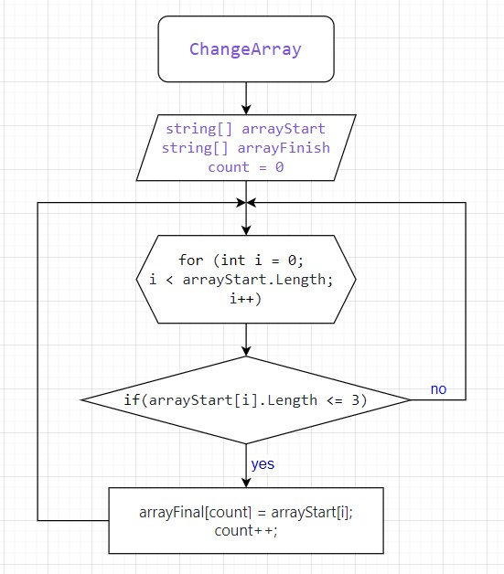

## Описание

Эта программа из имеющегося массива строк формирует новый массив из строк, длина которых меньше, либо равна 3 символам.

## Алгоритм

1. Ввод массива строк.
2. Создание пустого массива для хранения результатов.
3. Для каждого элемента в исходном массиве:
   - Если длина строки меньше или равна 3 символам, добавить строку в результирующий массив.
4. Вывод результирующего массива.

## Примеры

- `["Hello", "2", "world", ":-)"]` → `["2", ":-)"]`
- `["1234", "1567", "-2", "computer science"]` → `["-2"]`
- `["Russia", "Denmark", "Kazan"]` → `[]`

1. Вы находитесь в созданном репозитории Final-control-work-on-the-main-block.
## Блок-схема

2. Вы читаете данный фаил README.md
3. Программа находится в ветке master

